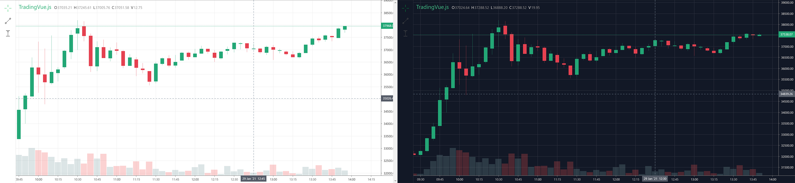
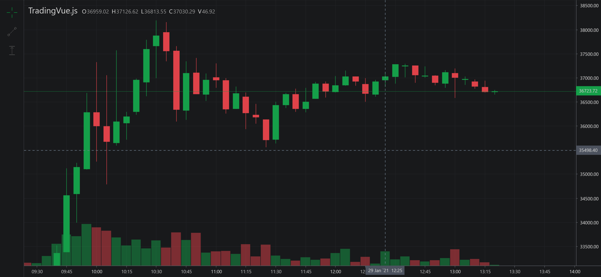

# DarkSide Colors and Skin

##### Before: The day/night pack


##### After: The DarkSide


## How to use

### Example 1: Using skin

```html
<template>
<trading-vue :data="dc" :extensions="ext" skin="darkside"/>
</template>
<script>

import TradingVue from 'trading-vue-js'
import XP from 'tvjs-xp'

export default {
    name: 'app',
    components: { TradingVue },
    data() {
        return {
            ext: [XP.darkside],
            dc: new DataCube(...)
        }
    }
}
</script>
```

### Example 2: Using colors

```html
<template>
<trading-vue :data="dc" :colors="colors"/>
</template>
<script>

import TradingVue from 'trading-vue-js'
import XP from 'tvjs-xp'

export default {
    name: 'app',
    components: { TradingVue },
    data() {
        return {
            colors: XP.darkside.colorpacks.darkside,
            dc: new DataCube(...)
        }
    }
}
</script>
```

### Example 3: Using colors as boilerplate

```html
<template>
<trading-vue :data="dc" :colors="colors"/>
</template>
<script>

import TradingVue from 'trading-vue-js'
import XP from 'tvjs-xp'

const mycolors = {
    title: 'red'
};

export default {
    name: 'app',
    components: { TradingVue },
    data() {
        return {
            colors: {...XP.darkside.colorpacks.darkside, ...mycolors},
            dc: new DataCube(...)
        }
    }
}
</script>
```